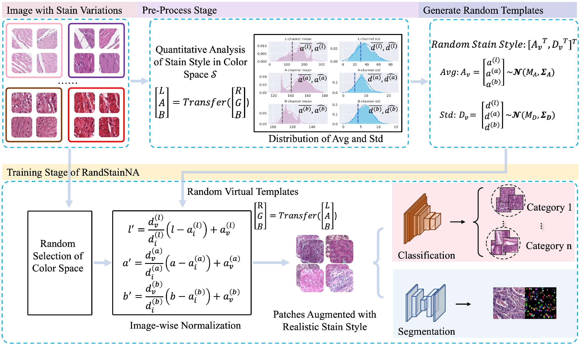

# RandStainNA

Implementation for the paper: "RandStainNA: Learning Stain-Agnostic Features from Histology Slides by Bridging Stain Augmentation and Normalization" [MICCAI 2022]

Paper link: https://arxiv.org/abs/2206.12694

## 1. Method Overview



RandStainNA is a augmentation scheme to train a stain agnostic deep learning model specifically for **histology** analysis. 
It unifies *Stain Normalization* and *Stain Augmentation* by constraining variable stain styles in a practicable range. 
The RandStainNA is applicable to stain normalization in a collection of color spaces i.e., HED, HSV, LAB.


## 2. Code Organizations
The codes are organized as follows:
- `visualization`: provides the visualization of stain normalizations, stain augmentations, and RandStainNA.
    - `origin`: the raw images.
    - `randstainna`: visualizations of images augmented by RandStainNA.
    - `stain_augmentation`: visualizations of images augmented by stain augmentation. 
    - `stain_augmentation`: visualizations of images processed by stain normalization. 
- `preprocess`: perform the statistics in the pre-processing stage. Results should be presented as [`CRC_LAB_randomTrue_n0.yaml`](./CRC_LAB_randomTrue_n0.yaml).
- `randstainna.py`: we warp RandStainNA in this file. 
- `main.py`: provides the use case for RandStainNA in `randstainna.py`.


## 3. Set Up the Environmets
Run 
```
pip install -r requirements.txt
```
to install the required libraries. Note that `opencv-python`, `pyyaml` and `scikit-image` are necessary for `RandStainNA`; while we use `fitter` for performing the statistic analysis in the pre-processing stage. 

## 4. Use RandStainNA as Data Augmentation

Please refer to [`main.py`](./main.py) for using RandStainNA:
```
transforms_list = [
        RandStainNA(yaml_file='./CRC_LAB_randomTrue_n0.yaml', std_hyper=-0.3, probability=1.0,distribution='normal', is_train=True)
    ]
    
transforms.Compose(transforms_list)
```

